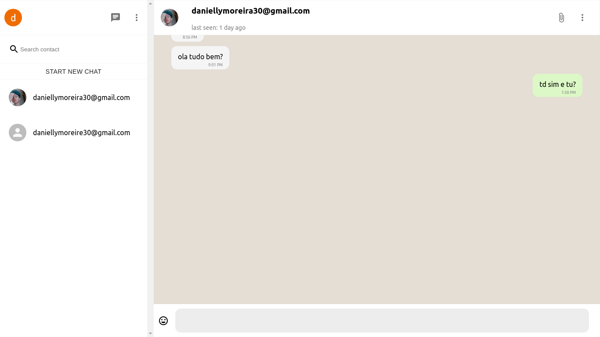

<p align="center">
  
</p>
<p align='center'> finish<p/>

<p align="center">
  <a href="#-projeto">Projeto</a>&nbsp;&nbsp;&nbsp;|&nbsp;&nbsp;&nbsp;
   <a href="#-Tecnologias">Tecnologias</a>
</p>
<p align="center">
 
  
</p>
<br>

## 🚀 Tecnologias

Esse projeto foi desenvolvido com as seguintes tecnologias:

[Front-end]
- java script [ecma6]
- html[JSX]
- css [Styling Components]
- react

[Backend]
- Next 
-Firebase

[Lint]

- eu geralmente uso versão <strong>airbnb</strong> que possui ; 
mas ocasionalmente troco pela <strong>standard</strong>.

## 💻 Projeto

O projeto sera o whatssap, usando react no front e next no back.

## :memo: Licença


Esse projeto está com licença Mit


# :wrench: How To Run
To run this app on your computer, run these commands inside the repository root folder

case you use npm just change to npm install pacote_name
```shell
#  install dependencies :
$ yarn

#  after install all dependencies, run :
$ yarn dev

# or using npm :
$ npm

# run npm :
$ npm run

```
---
